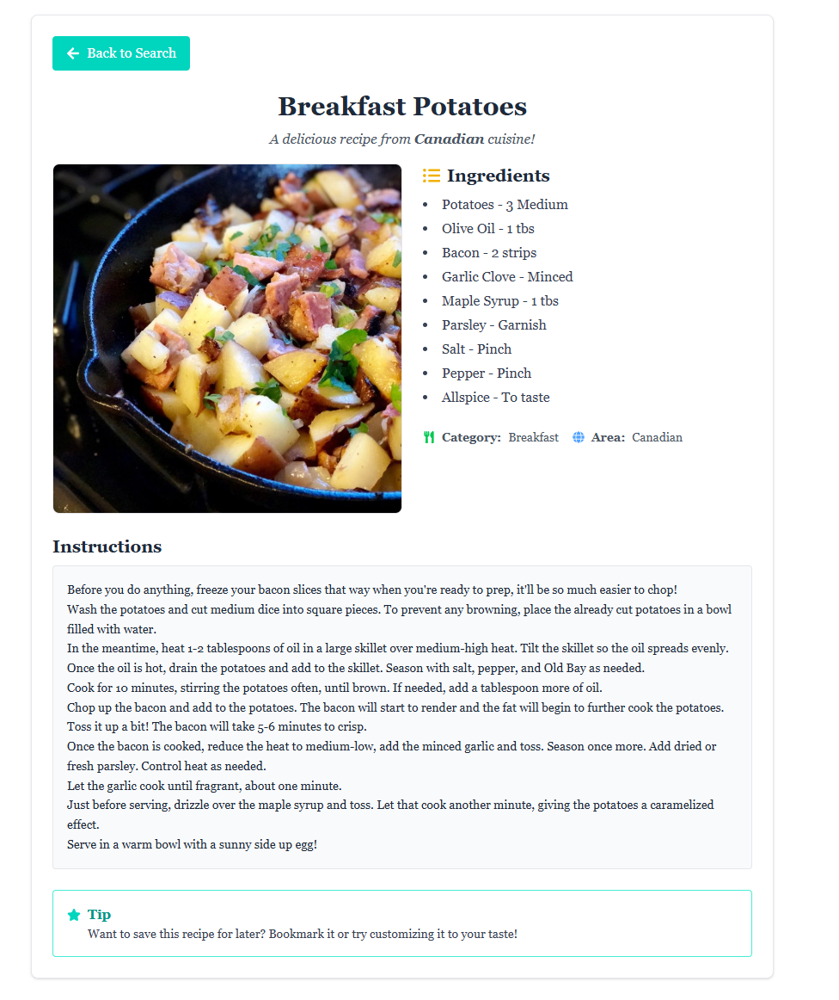
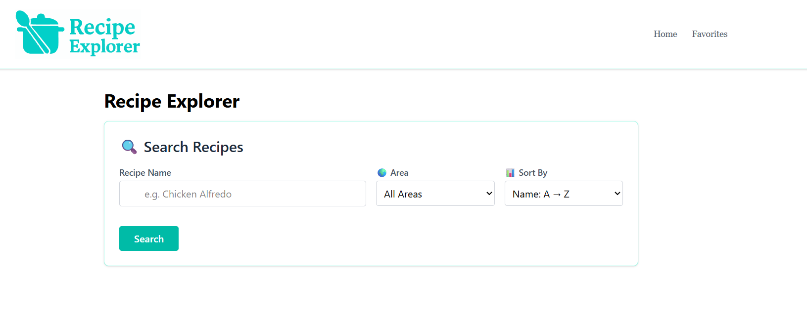

# Recipe Explorer

A sleek and interactive React app that lets users explore, filter, and view detailed information about global recipes. Built with TheMealDB API, React Router, Tailwind CSS, and a clean UI experience.

##  Features

-  **Search Recipes** by name with autocomplete-like functionality
-  **Filter by Area (Region)** for localized cuisine
-  **Sort recipes** by name or simulated preparation time
-  **View Detailed Recipes** with ingredients, area, category, and instructions
-  **Favorites Page** (structure in place for future enhancement)
-  **Responsive and modern UI** using Tailwind CSS
-  **Routing with React Router** for clean navigation

## Demo

## Tech Stack

- **React** – Component-based UI
- **React Router DOM** – Client-side routing
- **Tailwind CSS** – Utility-first styling
- **TheMealDB API** – Recipe data
- **Local State Management** – `useState`, `useEffect`

## Project Structure

src/
- components/
  - Header.js # Top navbar with links
  - RecipeSearch.js # Search bar with filters

- pages/
  - Home.js # Main landing with RecipeSearch
  -  Favorites.js # Placeholder for saved recipes
  -  RecipeDetail.js # Full recipe view

 - App.js # Routes and layout
 - index.js # Entry point

 ## Future Improvements

- Add support for saving favorite recipes (via localStorage or Context)
-  Improve mobile responsiveness
-  Add 404 Not Found route
-  Enhance search with debouncing
-  Pagination or infinite scroll for large results

##  Getting Started
1. **Clone the repository:**
git clone https://github.com/your-username/recipe-explorer.git
cd recipe-explorer

2. Install dependencies:
npm install

3. Start the app:
npm run dev